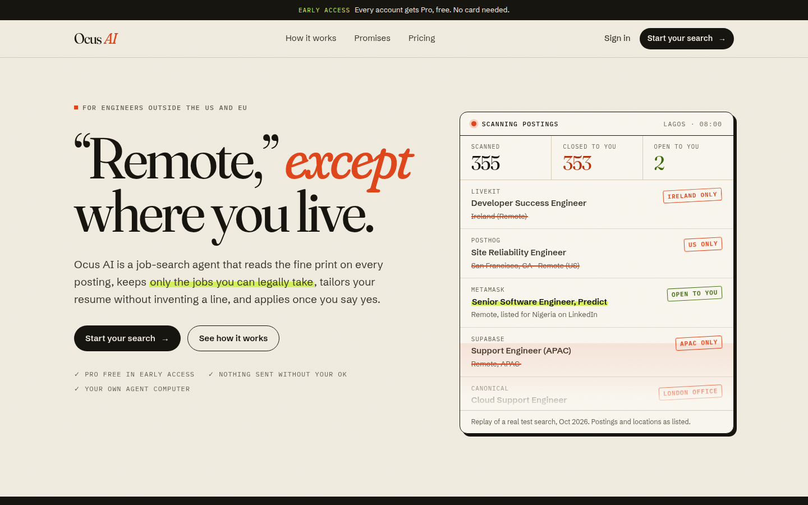
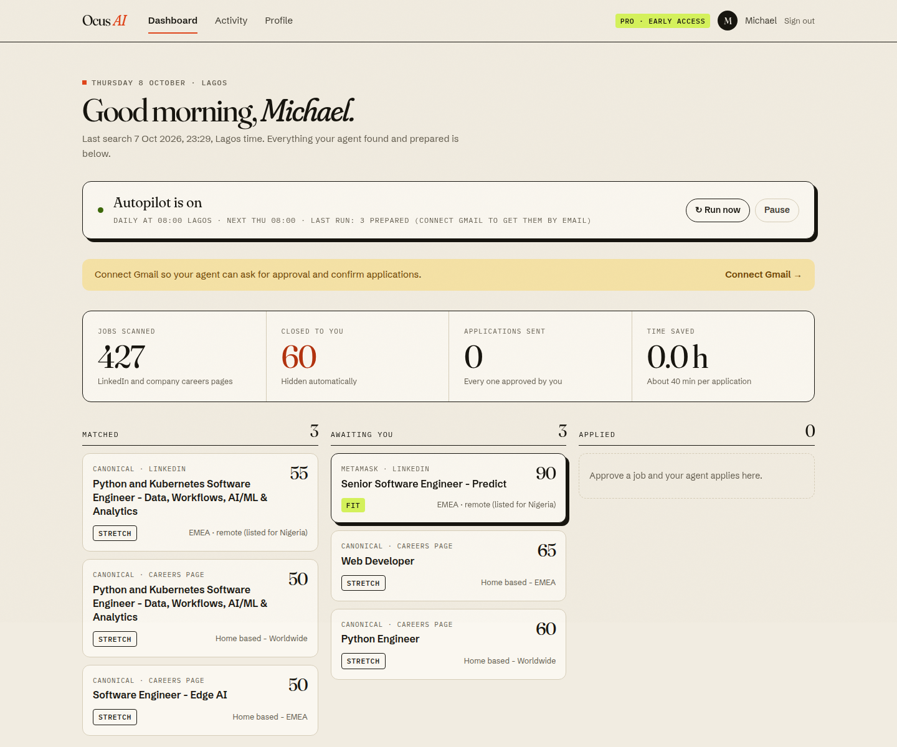
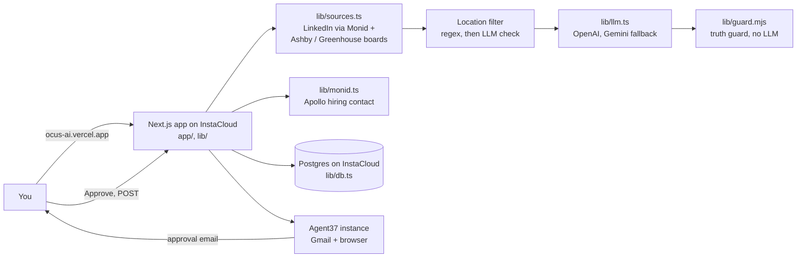

# Ocus AI

**A job-search agent for engineers outside the US and EU: it finds the "remote" jobs you can legally take, tailors your resume without inventing a line, finds the person hiring, and applies only after you approve.**

[Live app](https://ocus-ai.vercel.app) · [How it works](#how-it-works) · [What is real](#what-is-real-what-is-not)



Built at the **Build an Agent** hackathon (Oct 7, 2026) with **Agent37**, **Monid**, **InstaCloud** and **OpenAI**.

## The problem

In our test search, **514 of 518 "remote" jobs were closed to someone living in Nigeria**: "United States (Remote)", "Remote, AMER", "Hybrid (UK)". You find that out one posting at a time, after reading the description. Then each real match takes about 40 minutes of tailoring and form filling, and AI resume tools happily invent experience you don't have.

## What we built

You upload your resume once. Every morning at 08:00 Lagos time your agent:

1. searches LinkedIn and company careers pages, and hides every role closed to where you live;
2. scores what is left (fit / stretch / no; seniority is labelled, never hard-filtered);
3. tailors your resume for the top 3, where **code** checks that every line cites a real line of your resume;
4. finds the recruiter or engineering manager and drafts a short note **for you** to send;
5. emails you from your own Gmail. Tap Approve and your private agent computer fills and submits the application in its own browser.



## Sponsor integrations

| Technology | How we use it | Where |
|---|---|---|
| **Agent37** | Each user gets a private agent computer. It connects the user's Gmail, sends approval digests and "Applied" emails, receives the tailored PDF, and runs a streamed browser turn that fills and submits the form | [`lib/agent37.ts`](lib/agent37.ts), [`lib/apply.ts`](lib/apply.ts), [`lib/autopilot.ts`](lib/autopilot.ts) |
| **Monid** | LinkedIn job search (`harvestapi/linkedin-job-search`, filtered by location, workplace and seniority) and hiring-contact lookup through Apollo (free search, then one paid enrichment) | [`lib/monid.ts`](lib/monid.ts) |
| **InstaCloud** | Hosts the app (always-on compute, built from the `Dockerfile`) and its Postgres 16 database | [`Dockerfile`](Dockerfile), [`lib/db.ts`](lib/db.ts) |
| **OpenAI** | Primary LLM for scoring, tailoring, outreach and resume parsing, with JSON output. Gemini is the fallback, with per-model rate limits | [`lib/llm.ts`](lib/llm.ts) |

**Agent37** is the hands of the agent, not a notification hook. Apply uploads the PDF to the instance, then runs a browser turn whose tool steps stream back into the job's agent log; it must end with `RESULT: SUBMITTED` or `RESULT: BLOCKED`. **Monid** is the eyes: one key gives us LinkedIn and Apollo, and async runs are polled to completion.

## How it works



The scheduler in `instrumentation.ts` checks every 5 minutes for users whose next run is due. Approval links carry a 72-hour token for that one job, and Approve is a POST button on the page, never a GET link in the email.

## Technical highlights

- **A truth guard that is code, not a prompt.** `lib/guard.mjs` rejects any tailored line that cites no real resume line, adds a number, or names a technology that isn't on the resume. Failing lines get one retry, then they are removed. Real runs: 12/12, 15/15 and 17/17 lines cited.
- **Uploaded resumes are checked word for word.** The LLM structures your PDF, then `lib/resume.ts` drops any line that doesn't appear verbatim in the extracted text.
- **Eligibility before relevance.** A regex verdict on the location string runs first, then the LLM reads the description for limits like "AMER only". Blank form answers become "needs you" on the approval page instead of a guess.

## Quick start

```bash
git clone https://github.com/MikeMoulder/ocus && cd ocus
cp .env.example .env.local   # fill in the keys; each one is explained in the file
npm install
npm run dev                  # http://localhost:3000
```

Sign in with any Demo ID and passcode, then tap **Use the demo resume**. With no `DATABASE_URL` the app stores data in `.data/db.json`. Searching needs `MONID_API_KEY` and an LLM key; email and applying need `AGENT37_API_KEY`.

## What is real, what is not

- **Real and tested:** search across LinkedIn and four company boards (427 jobs in about 13 seconds), the location filter, scoring, tailoring with the truth guard, PDF export, hiring-contact lookup, outreach drafts, and a full autopilot round (113 s, 3 matches prepared).
- **Built, not yet verified end to end:** the Gmail connection, the digest email, and the browser apply. Approving submits a real application, so we have not run it against a live posting.
- **Not built:** payments (plans are listed but there is no checkout; early access gets Pro free), passkey and OAuth sign-in (demo IDs only), and Supabase in production (the code supports it; we run on InstaCloud Postgres).

## Next

Verify the apply path on a sandbox posting, store a confirmation screenshot for each application, move the daily schedule to Agent37 cron, and add more company boards.
